<style>
   img {
    border-radius: 25px;
   }
</style>

# MSA Lab 2 Containers

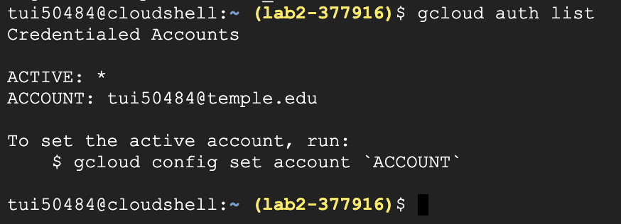<br>
This command displays the active account that we are using to access the Google cloud platform. 

## Task 1. Hello World 

The first task of this lab has us pull a docker container from the public registry "Docker Hub" and shows us a few basic commands for viewing our docker resources

### 1.1
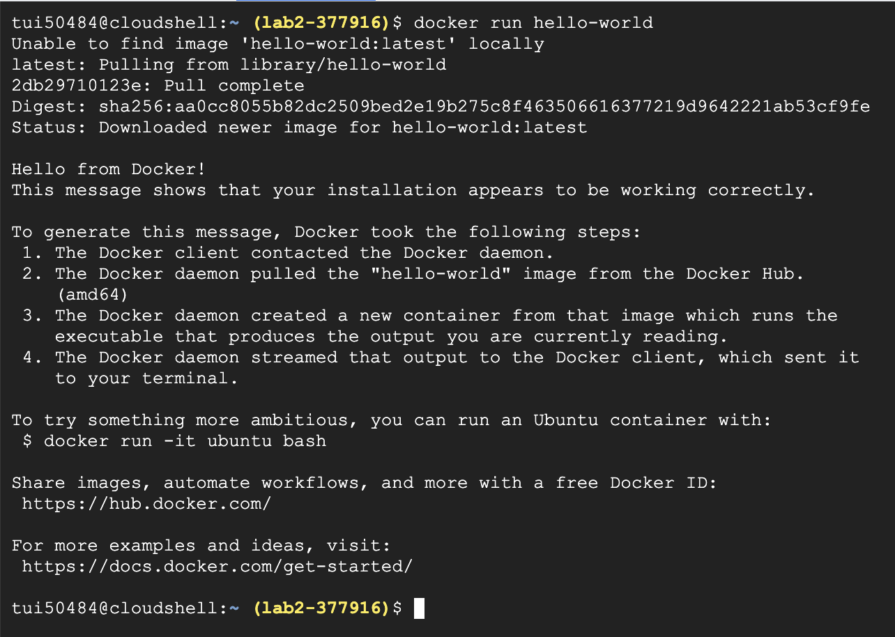<br>
```
docker run hello-world
```
This command looks for an image called 'hello-world' and because it doesn't exist on my system it pulls it from Docker Hub. Docker then runs this image in a container which generates the message pictured above. 

### 1.2
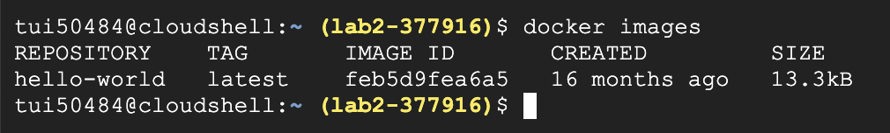<br>
```
docker images
```
This command shows us all the docker images we currently have on our system. We can see that this image was created 16 months ago because I did not actually create this image I just cloned it from Docker. 

### 1.3
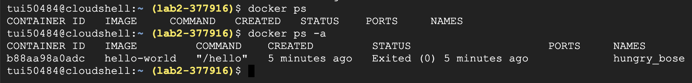<br>
```
docker ps
```
This command lists all the containers, ps stands for process status. Docker containers run on the system as processes, so this command effectively lists all active containers. When we add the -a tag all docker processes running or finished are listed. We can see after running the command with the -a tag that we have one finished container. 

## Task 2. Build

### 2.1
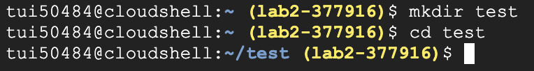<br>
```
mkdir test 
```
```
cd test 
```
The first command makes a new directory called "test" and the second command navigates us to that directory (changes our PWD to /test).

### 2.2
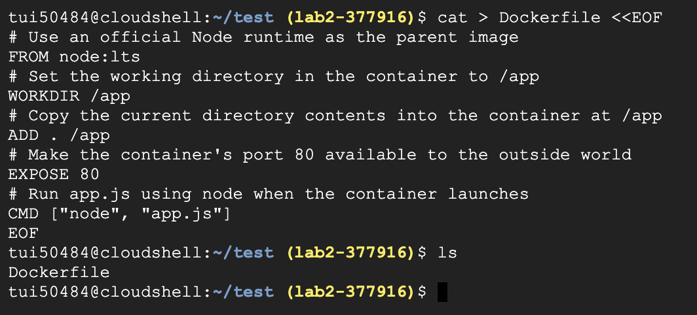<br>
```
cat > Dockerfile <<EOF
# Use an official Node runtime as the parent image
FROM node:lts
# Set the working directory in the container to /app
WORKDIR /app
# Copy the current directory contents into the container at /app
ADD . /app
# Make the container's port 80 available to the outside world
EXPOSE 80
# Run app.js using node when the container launches
CMD ["node", "app.js"]
EOF
```
This command creates a new Dockerfile and adds the text to that file
Cat (concatenate) combined with the output redirection operator “>” creates a new file with the name Dockerfile. The <<EOF tag instructs the shell to read the information until it finds a line containing the EOF character. So all together this command creates a new file named Dockerfile and redirects the lines below the command into the file until it reads the EOF character.

### 2.3
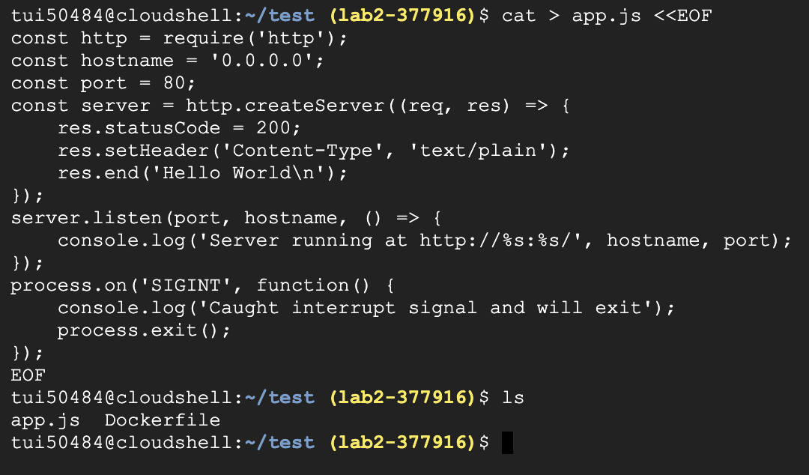<br>
```
cat > app.js <<EOF
const http = require('http');
const hostname = '0.0.0.0';
const port = 80;
const server = http.createServer((req, res) => {
    res.statusCode = 200;
    res.setHeader('Content-Type', 'text/plain');
    res.end('Hello World\n');
});
server.listen(port, hostname, () => {
    console.log('Server running at http://%s:%s/', hostname, port);
});
process.on('SIGINT', function() {
    console.log('Caught interrupt signal and will exit');
    process.exit();
});
EOF
```
This command is similar to the last command, but it creates an app.js file for a node.js server

### 2.4
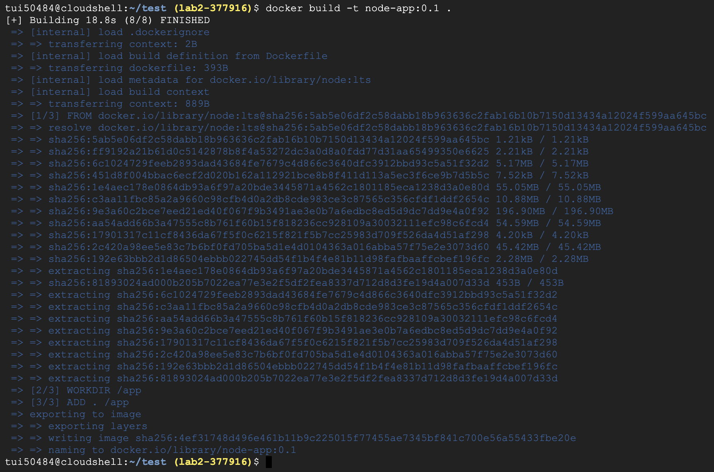<br>
```
docker build -t node-app:0.1 .
```
This command builds a new docker image containing our recently created config files.

### 2.4
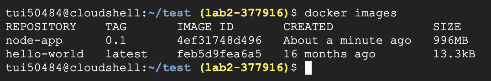<br>
```
docker images
```
This command lists the docker images on our system. Here we can see that there are 2 new docker images in addition to the hello-world image we pulled in task 1. 

## Task 3. Run 
### 3.1
```
docker run -p 4000:80 --name my-app node-app:0.1
```
This command runs our new image node-app and redirects port 4000 on our local machine to port 80 of the container. After running this command we should get an output of Server running at http://0.0.0.0:80/ 

### 3.2
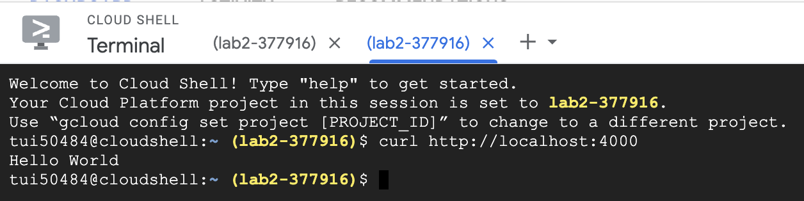<br>
```
curl http://localhost:4000
```
This command "curl" stands for client url and is used here to get information from a web page. If you run curl on an html page it returns the html file. Here it returns the message we specified in app.js. This means that our server is working on our machine. 

### 3.2
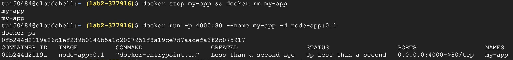<br>
```
docker stop my-app && docker rm my-app
```
This command stops and removes our recently created docker container. 
```
docker run -p 4000:80 --name my-app -d node-app:0.1
```
This command runs our image again as a container but this time in the background, so we don't need to switch terminal windows. When we run `docker ps` after executing the above command we can see that our process is running as process id 0fb...

### 3.3
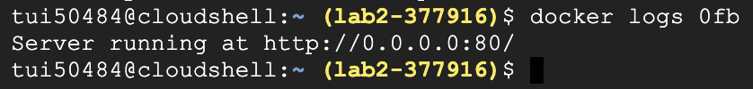<br>
```
docker logs [container_id]
```
This command fetches the logs of a container. We can see from the output our server is running successfully on port 80 of our container. 


### 3.4
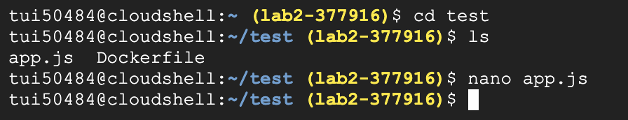<br>
```
nano app.js
```
This command opens up the app.js file in the nano text editor, so we can edit the message. I changed the message to "Welcome to Lab2 cloud".
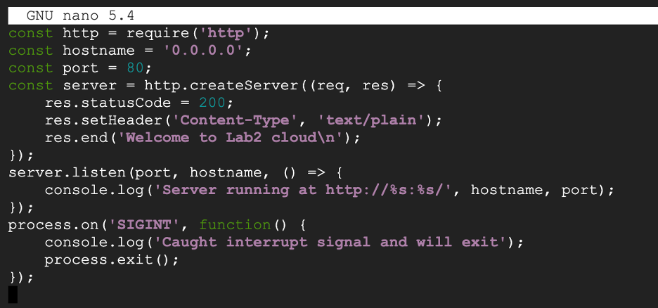<br>

### 3.5
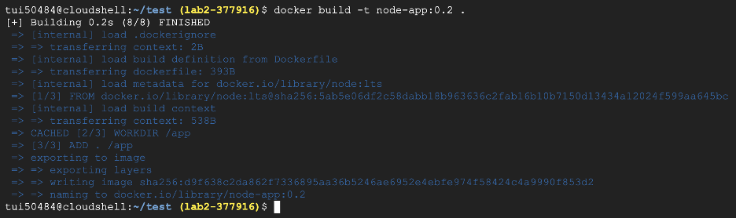<br>
```
docker build -t node-app:0.2 .
```
This command builds a new Docker image with the tag 0.2 so we can differentiate it from our original image. 

### 3.5
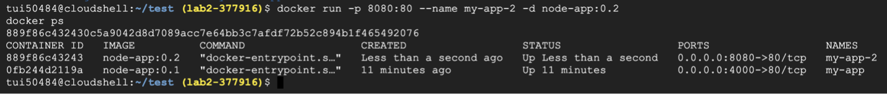<br>
```
docker run -p 8080:80 --name my-app-2 -d node-app:0.2
```
This command runs our new image as a container. After running `docker ps` we can see that there are 2 docker containers running on our system. Our original container is still running as node-app:0.1, and we have a new container running as node-app:0.2. Notice we are mapping a different port (8080) from our local system to port 80 of this new container because port 4000 is still in use by our previous container. 

### 3.6
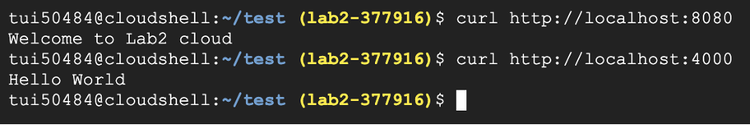<br>
```
curl http://localhost:8080
```
```
curl http://localhost:4000
```
After using the `curl` command on both of the ports in use by our docker containers we can see that the correct messages are being broadcasted. This means our new container is working and has the updated version of the app.js file. 

## Task 4. Debug 
### 4.1
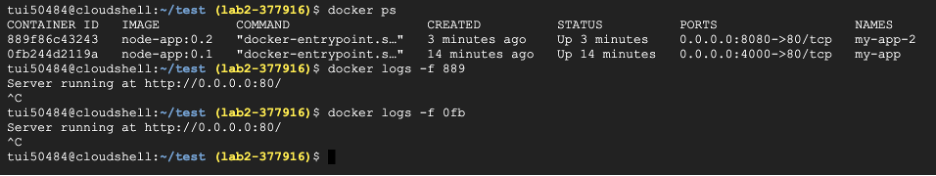<br>
```
docker logs -f [container_id]
```
This command above pulls the logs for the given docker container. After looking at the logs for both our containers we see that they are both successfully running on the container port 80. 

### 4.2
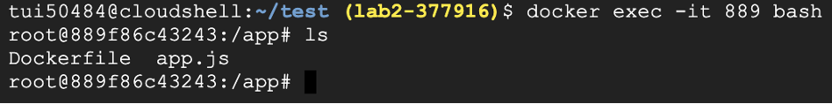<br>
```
docker exec -it [container_id] bash
```
This command enters a terminal inside the specified running docker container. The -it flag allows us to enter this shell without closing our stdin and stdout. We can use the `ls` command to view our files which are the same 2 files we created that are contained in the image we built. To exit back into our normal shell we can use `exit`

### 4.4
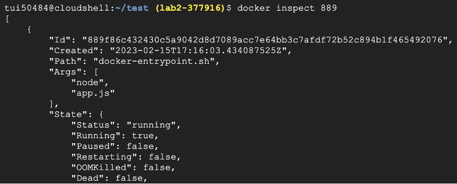<br>
```
docker inspect [container_id]
```
This command prints a long string containing the metadata of the specified container.

### 4.5
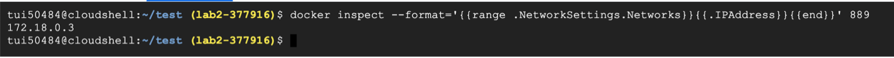<br>
```
docker inspect --format='{{range .NetworkSettings.Networks}}{{.IPAddress}}{{end}}' [container_id]
```
This command is similar to the last command, but we are using the `--format` tag and few input parameters to parse for the ip address of our container. 

## Task 5. Publish
### 5.1
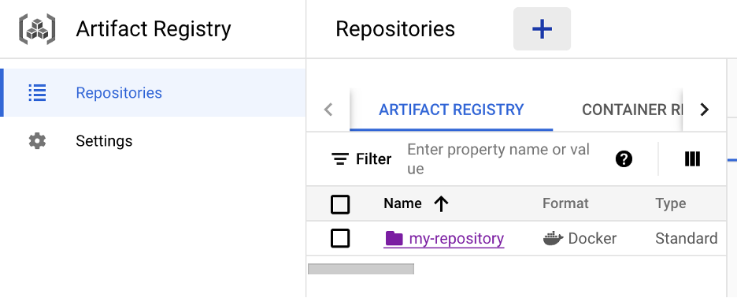<br>
First we need to go into our Google cloud account and find the artifact registry. We set `my-repository` as the name, Docker as the format, and `us-central1(Iowa)` as the region. 

### 5.2
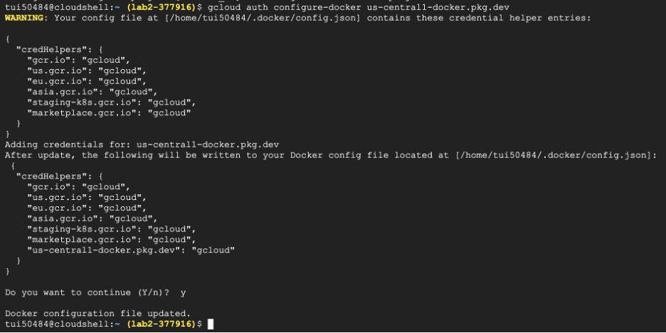<br>
```
gcloud auth configure-docker us-central1-docker.pkg.dev
```
We then use the above command to allow us to push and pull to the artifact registry. This command edits the docker config file container at `/home/tui50484/.docker/config.json`

### 5.3
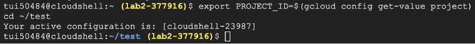<br>
```
export PROJECT_ID=$(gcloud config get-value project)
```
This command sets our `PROJECT_ID` global variable before we push to the artifact registry. We then run `cd ~/test` to navigate into our test directory.

### 5.4
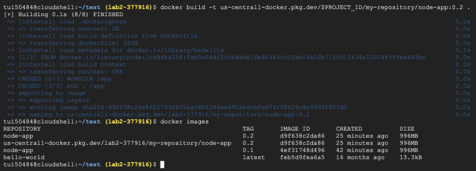<br>
```
docker build -t us-central1-docker.pkg.dev/$PROJECT_ID/my-repository/node-app:0.2 .
```
This command builds our image and tags it with the 0.2 tag. When we run `docker images` we can see our image has been successfully built. The period at the end tell docker to built what is in our current directory. 

### 5.5
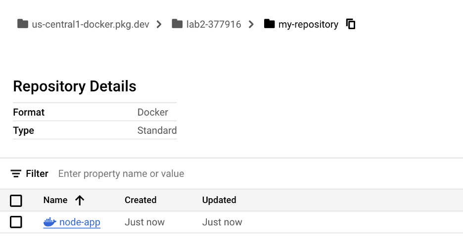<br>
```
docker push us-central1-docker.pkg.dev/$PROJECT_ID/my-repository/node-app:0.2
```
This command pushes our image to the artifact registry. We can see the push was a success by looking at our artifact registry in the Google cloud console. 

## Test 
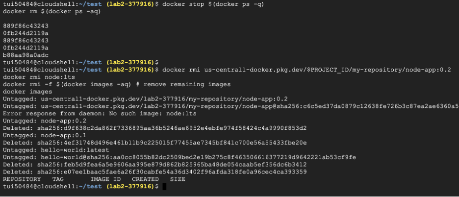<br>
```
docker stop $(docker ps -q)
```
```
docker rm $(docker ps -aq)
```
These commands stop and remove all of our containers. 

```
docker rmi us-central1-docker.pkg.dev/$PROJECT_ID/my-repository/node-app:0.2
docker rmi node:lts
docker rmi -f $(docker images -aq) # remove remaining images
docker images
```

These commands stop and remove all of our images. When we run `docker images` at the end, we can see we have no images on our system. 

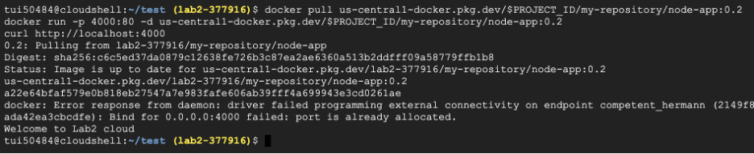<br>
```
docker pull us-central1-docker.pkg.dev/$PROJECT_ID/my-repository/node-app:0.2
docker run -p 4000:80 -d us-central1-docker.pkg.dev/$PROJECT_ID/my-repository/node-app:0.2
curl http://localhost:4000
```
The first command here pulls our docker image from the artifact registry. The second command starts our container using the pulled image. When we run `curl` at the end we can see that our server is successfully running on the local port 4000. 
